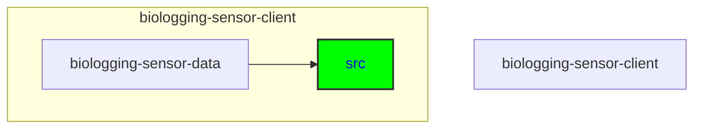

```mermaid
graph TD
    A["biologging-sensor-client"] 
    B["biologging-sensor-data"]
    C["<span style='color:blue'>src</span>"]

    subgraph biologging-sensor-client
        B --> C
    end

    style C fill:#0f0,stroke:#333,stroke-width:2px;

```
