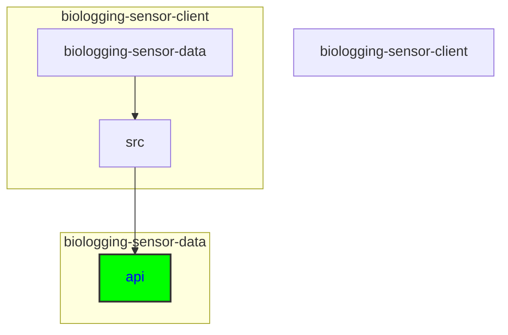

```mermaid
graph TD
    A["biologging-sensor-client"] 
    B["biologging-sensor-data"]
    C["src"]
    D["<span style='color:blue'>api</span>"]

    subgraph biologging-sensor-client
        B --> C
    end
    subgraph biologging-sensor-data
        C --> D
    end

    style D fill:#0f0,stroke:#333,stroke-width:2px;

```
