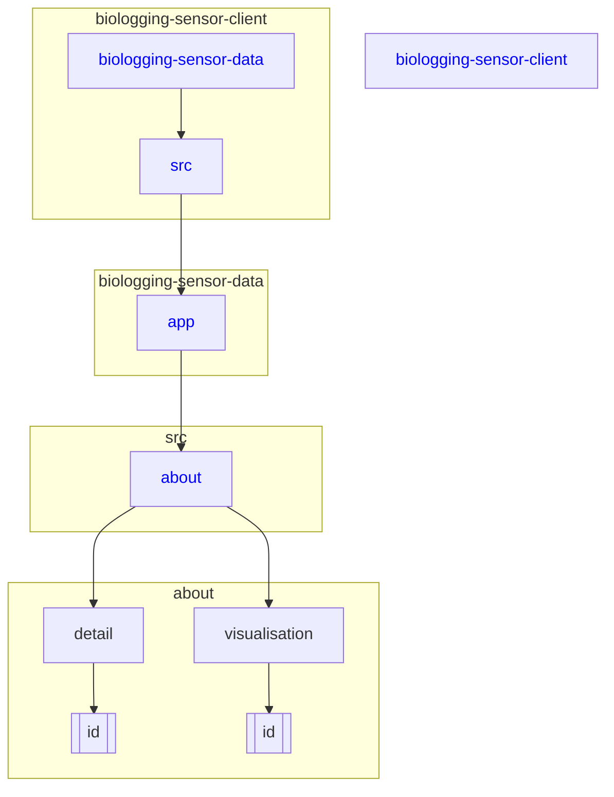

```mermaid
graph TD
    A["<span style='color:blue'>biologging-sensor-client</span>"] 
    B["<span style='color:blue'>biologging-sensor-data</span>"]
    C["<span style='color:blue'>src</span>"]
    D["<span style='color:blue'>app</span>"]
    E["<span style='color:blue'>about</span>"]
    F[detail]
    G[[id]]
    H[visualisation]
    I[[id]]

    subgraph biologging-sensor-client
        B --> C
    end
    subgraph biologging-sensor-data
        C --> D
    end
    subgraph src
        D --> E
    end
    subgraph about
        E --> F
        F --> G
        E --> H
        H --> I
    end

```
