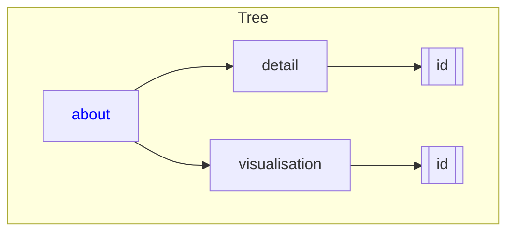

```mermaid
graph TD
    A["<span style='color:blue'>about</span>"] 
    B[detail]
    C[[id]]
    D[visualisation]
    E[[id]]

    subgraph Tree
        A --> B
        B --> C
        A --> D
        D --> E
    end
```
