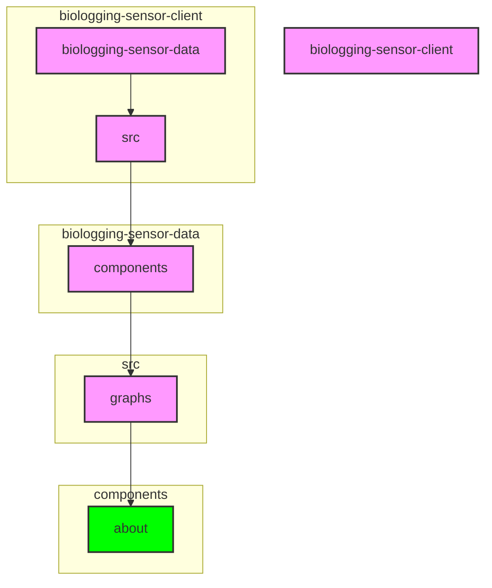

```mermaid
graph TD
    A["biologging-sensor-client"] 
    B["biologging-sensor-data"]
    C["src"]
    D["components"]
    E["graphs"]
    F["about"]

    subgraph biologging-sensor-client
        B --> C
    end
    subgraph biologging-sensor-data
        C --> D
    end
    subgraph src
        D --> E
    end
    subgraph components
        E --> F
    end

    style A fill:#f9f,stroke:#333,stroke-width:2px;
    style B fill:#f9f,stroke:#333,stroke-width:2px;
    style C fill:#f9f,stroke:#333,stroke-width:2px;
    style D fill:#f9f,stroke:#333,stroke-width:2px;
    style E fill:#f9f,stroke:#333,stroke-width:2px;
    style F fill:#0f0,stroke:#333,stroke-width:2px;


```
